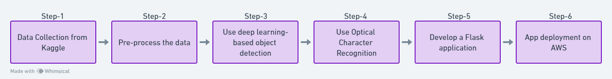

# CV-NUMBER-PLATE-RECOGNITION

## Problem Statement
Vehicle number plate recognition is a crucial task for various applications, including traffic monitoring, parking management, and security surveillance. Manual recognition is not scalable and can be error-prone. An automated solution is required to efficiently and accurately recognize number plates from vehicle images.

## Solution
The application is built in six steps:
1. Data Collection from Kaggle: images along with their corresponding annotations
2. Pre-process the data: unstructured data into structured data for training (bounding box information)
3. Use deep learning-based object detection using deep learning to detect the number plate of a car image: pre-trained Inception-ResNet-v2 and finetune it on collected data
4. Use Optical Character Recognition to extract the characters and digits from the detected number plate: Paddle OCR
5. Develop a Flask application
6. App deployment on AWS



## Possible Applications Areas
1) Parking lots
2) TollPlaza
3) Traffic Junctions
4) Vehicle Surveillance
   
## How to Run the Code
1. **Setup**: Install the required packages:
   ```bash
   pip install -r requirements.txt
   ```
2. **Run the Application**: Execute the main application file: 
   ```bash
   python app.py
   ```
   

